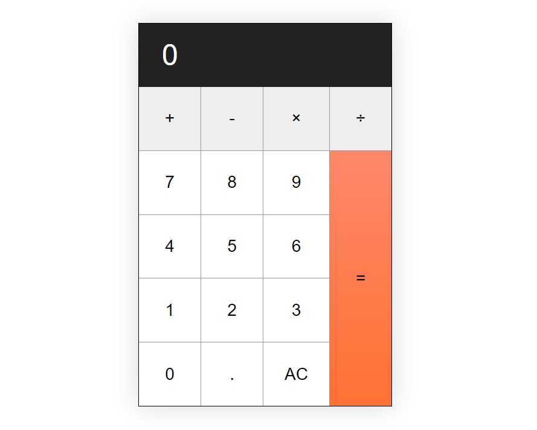

# JavaScript Calculator App
 
 ### A typical calculator build with HTML, CSS and Javascript.
 
#### Play it [here](https://trevorton27.github.io/js-calculator/)
 
 
 
 
## Summary
This was initially a very challenging project as a beginner but I learned a lot; especially about how helpful the Google Chrome browser developer tools can be. By the time I finished building this app, I felt I'd deepened my JavaScript skills considerably. 
But, then again, there's always more to learn.
## Author
Trevor Mearns - Full Stack Software Developer [LinkedIn](https://www.linkedin.com/in/trevor-mearns-8a042a56/) | [Personal Website](https://trevormearns.com/)
